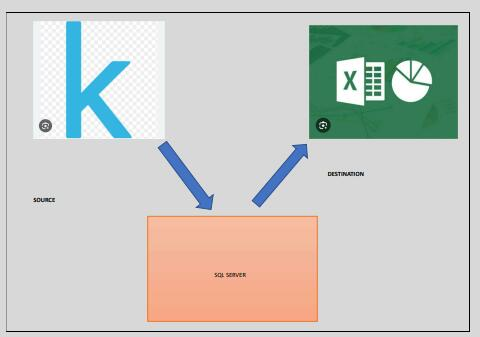

# Data Portfolio: Kaggle to pivot chart in Excel.

# Table of contents 

- [Objective](#objective)
- [Data Source](#data-source)
- [Stages](#stages)
- [Design](#design)
  - [Mockup](#mockup)
  - [Tools](#tools)
- [Development](#development)
  - [Pseudocode](#pseudocode)
  - [Data Exploration](#data-exploration)
  - [Data Cleaning](#data-cleaning)
  - [Transform the Data](#transform-the-data)
  - [Create the SQL View](#create-the-sql-view)
- [Testing](#testing)
  - [Data Quality Tests](#data-quality-tests)
- [Visualization](#visualization)
  - [Results](#results)
- [Analysis](#analysis)
  - [Findings](#findings)
  - [Validation](#validation)
  - [Discovery](#discovery)
- [Recommendations](#recommendations)
  - [Potential ROI](#potential-roi)
  - [Potential Courses of Actions](#potential-courses-of-actions)
- [Conclusion](#conclusion)

# Objective 

- What is the key pain point? 

The Head of Marketing wants to find out the under represented demographic groups to determine where marketing campaigns should be improved.

- What is the ideal solution? 

To create a pivot chart that indicates the least sales. The chart should present the following information: 
- the age group
- the country 
- the gender
  

This will help the marketing team make informed decisions about where marketing improvements should be made.

# User story 

As the Head of Marketing, I want to use a pivot table that analyses sales for our bicycle company.

This dashboard should allow me to identify the the age group and country with the least sales.

With this information, I can make more informed decisions about where to improve sales.

# Data source 

- What data is needed to achieve our objective?

We need data on the company's sales for the past 5 years, to see how sales have been going. The data should include the following:
- sales made
- country
- age group
- gender

- Where is the data coming from? 
The data is sourced from the company's database(an Excel extract), [see here to find it.](https://www.kaggle.com/datasets/bhavyadhingra00020/top-100-social-media-influencers-2024-countrywise?resource=download)

# Stages

- Design
- Developement
- Testing
- Analysis
  
 # Design
## Pivot chart components required 
- What should the pivot chart contain based on the requirements provided?

To understand what it should contain, we need to figure out what questions we need the dashboard to answer:

1. Which areas have the least amount of sales?
2. Which age group buys the product the most?
3. Which gender uses the product the least?
4. Where can we implement new marketing strategies?

## Pivot chart

- What should it look like? 

Some of the data visuals that may be appropriate in answering our questions include:

1. Bar charts
2. Pie charts
3. Clustered column chart
4. Horizontal bar chart 

Tools 

| Tool | Purpose |
| --- | --- |
| Excel | Exploring the data |
| SQL Server | Cleaning, testing, and analyzing the data |
| Pivot chart | Visualizing the data |
| GitHub | Hosting the project documentation and version control |

# Development

## Pseudocode

- What's the general approach in creating this solution from start to finish?

1. Get the data
2. Explore the data in Excel
3. Load the data into SQL Server
4. Clean the data with SQL
5. Test the data with SQL
6. Visualize the data in Pivot chart
7. Generate the findings based on the insights
8. Write the documentation + commentary
9. Publish the data to GitHub Pages
## Data exploration notes

This is the stage where you have a scan of what's in the data, errors, inconcsistencies, bugs, weird and corrupted characters etc  

- What are your initial observations with this dataset? What's caught your attention so far? 

1. There are at least 4 columns that contain the data we need for this analysis, which signals we have everything we need from the file without needing to contact the client for any more data. 
2. The first column contains the channel ID with what appears to be channel IDS, which are separated by a @ symbol - we need to extract the channel names from this.
3. Some of the cells and header names are in a different language - we need to confirm if these columns are needed, and if so, we need to address them.
4. We have more data than we need, so some of these columns would need to be removed

## Data cleaning 
- What do we expect the clean data to look like? (What should it contain? What contraints should we apply to it?)

The aim is to refine our dataset to ensure it is structured and ready for analysis. 

The cleaned data should meet the following criteria and constraints:

- Only relevant columns should be retained.
- All data types should be appropriate for the contents of each column.
- No column should contain null values, indicating complete data for all records.

Below is a table outlining the constraints on our cleaned dataset:

| Property | Description |
| --- | --- |
| Number of Rows | 100 |
| Number of Columns | 4 |

And here is a tabular representation of the expected schema for the clean data:

| Column Name | Data Type | Nullable |
| --- | --- | --- |
| channel_name | VARCHAR | NO |
| total_subscribers | INTEGER | NO |
| total_views | INTEGER | NO |
| total_videos | INTEGER | NO |

- What steps are needed to clean and shape the data into the desired format?

1. Remove unnecessary columns by only selecting the ones you need
2. Extract Youtube channel names from the first column
3. Rename columns using aliases

### Transform the data 

    
